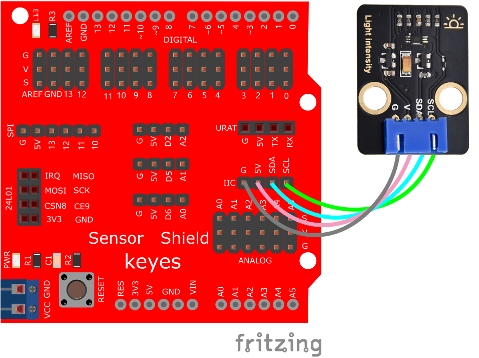

# Arduino


## 1. Arduino简介  

Arduino是一种开源电子原型平台，旨在帮助用户学习电子与编程的基本概念。Arduino开发板（如UNO）支持多种传感器和模块，允许用户通过简单的编程（基于C/C++语言）构建互动项目。它被广泛应用于教育、创客活动及个人工作室，提供丰富的社区资源与教程，适合各类技术水平的学习者。Arduino的可编程性与灵活性使得它在智能家居、机器人、艺术装置等领域具有广泛的应用。  

## 2. 接线图  

  

## 3. 测试代码  

```arduino  
#include <Wire.h>  

#define ADDRESS_BH1750FVI 0x23 //ADDR="L" for this module  

#define ONE_TIME_H_RESOLUTION_MODE 0x20  

//One Time H-Resolution Mode:  

//Resolution = 1 lux  

//Measurement time (max.) = 180ms  

//Power down after each measurement  

byte highByte = 0;  

byte lowByte = 0;  

unsigned int sensorOut = 0;  

unsigned int illuminance = 0;  

void setup() {  
    Wire.begin();  
    Serial.begin(115200);  
}  

void loop() {  
    Wire.beginTransmission(ADDRESS_BH1750FVI); //"notify" the matching device  
    Wire.write(ONE_TIME_H_RESOLUTION_MODE); //set operation mode  
    Wire.endTransmission();  
    
    delay(180);  
    Wire.requestFrom(ADDRESS_BH1750FVI, 2); //ask Arduino to read back 2 bytes from the sensor  

    highByte = Wire.read(); // get the high byte  
    lowByte = Wire.read(); // get the low byte  

    sensorOut = (highByte << 8) | lowByte;  
    illuminance = sensorOut / 1.2;  

    Serial.print(illuminance);   
    Serial.println(" lux");  
    
    delay(1000);  
}  
```  

## 4. 测试结果  

根据光线强弱，数值会相应变化，光线强，则数值大，反之，则小。打开串口监视器，设置波特率为115200，显示如下图。  


