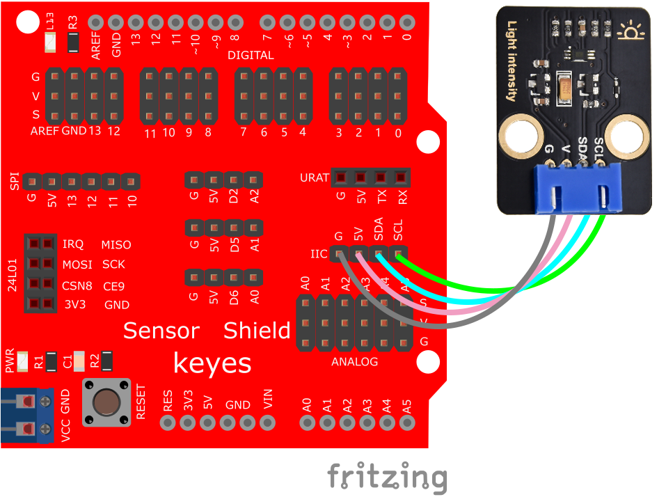
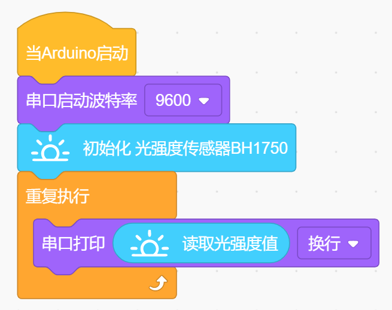
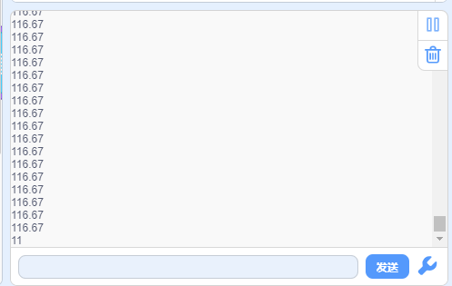

# KidsBlock

## 1. KidsBlock简介  

KidsBlock是一种基于图形化界面的编程平台，旨在帮助儿童和初学者轻松学习编程概念。它采用了类似Scratch的拖拽式设计，允许用户通过简单的模块拼接创建程序。KidsBlock支持Arduino编程，结合真实硬件进行互动，让学习者能够快速掌握基础编程技巧，同时提升对电子和机器人原理的理解。平台提供丰富的示例和项目，适合教育和创客活动，鼓励创造性思维与实践学习。  

## 2. 接线图  

  

## 3. 测试代码（测试软件版本：KidsBlock Desktop 1.1.2）  

  

## 4. 测试结果  

根据光线强弱，数值会相应变化，光线强，则数值大，反之，则小。打开串口监视器，设置波特率为9600，显示如下图。  

